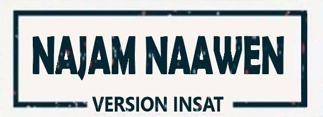

# Najem-naawen-INSAT-version  

It's a website that helps INSAT students search for opportunities concerning jobs and scholarships. There is also a forum in which students can ask questions. 
The INSAT student can find and apply in all job opportunities, he can also create its own CV. 

My team and I worked on this full-stack project : 

* In the frontend part, we used Angular.

* In the backend part, we used Symfony and MySQL as a database. 

